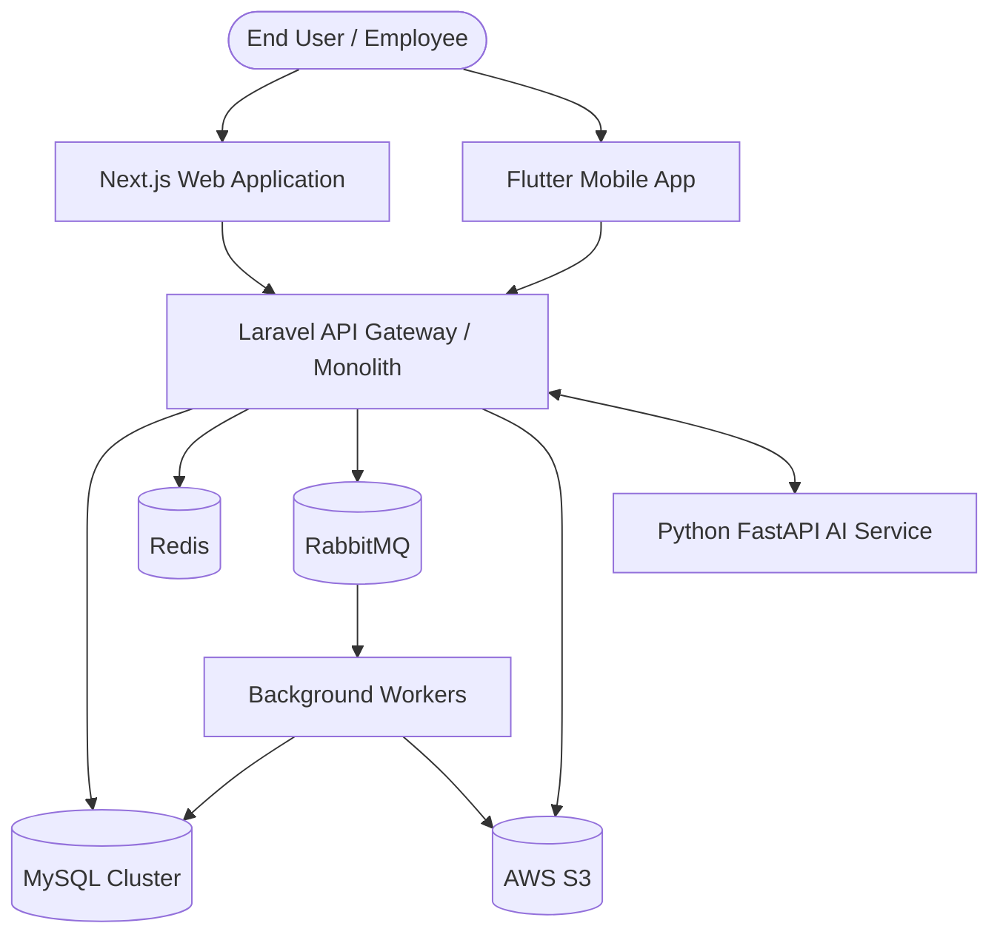
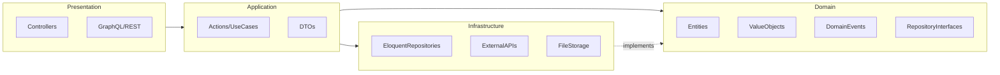

# ARCHITECTURE.md

## Purpose
This document defines the overarching architectural patterns for the Construction ERP system. It ensures a highly decoupled, scalable, and resilient application capable of serving complex business processes and a massive influx of data over a long lifecycle.

## Scope
Defines the structure for the Backend (Laravel), Frontend (Next.js), AI Services (Python), and asynchronous job processors.

## Design Principles

### 1. Clean Architecture & Domain-Driven Design (DDD)
The backend is structured using Clean Architecture principles combined with DDD to isolate the core business domain from framework and infrastructure concerns.

**Layers:**
- **Domain Layer**: Contains Entities, Value Objects, and Domain Events. Completely independent of Laravel or external libraries.
- **Application Layer**: Contains Use Cases (Actions/Services). Orchestrates business workflows using interfaces defined in the Domain layer.
- **Infrastructure Layer**: Implements Repositories, API integrations, and Database specifics.
- **Presentation Layer**: Controllers, API resources, Web routes, and Next.js UI.

### 2. Bounded Contexts
To maintain a Modular Monolith architecture, the application is divided into strict bounded contexts. Each context manages its own data and logic and communicates with other contexts via domain events or internal API contracts, NOT through direct database joins.

**Core Contexts:**
- Inventory (Land, Blocks, Lots, Houses)
- Projects (Construction, Timelines)
- Financials (Budgets, Expenses, Invoicing)
- Sales (Leads, Customers, Contracts)
- Workforce (Employees, Contractors)
- Supply Chain (Warehouse, Procurement)

### 3. Modular Monolith to Microservices
We are adopting a **Modular Monolith** pattern.
- **Why?** It reduces initial operational overhead while enforcing strict module boundaries.
- **Migration Path**: Because modules communicate strictly through interfaces and an internal event bus, any context (e.g., Financials) can be extracted into a separate microservice later with zero changes to its core domain logic.

## Architecture Decisions

### CQRS (Command Query Responsibility Segregation)
For highly complex contexts (e.g., Reports and Analytics), we separate the read models from the write models.
- **Commands**: Modify state (e.g., `CreateContractAction`). They write to the primary MySQL transactional database.
- **Queries**: Read state. They may read from optimized MySQL views or a denormalized cache in Redis.

### Event Bus & Asynchronous Processing
We use an Event-Driven Architecture to decouple side effects.
- **Domain Events**: Dispatched when something happens in the domain (e.g., `HouseCompletedEvent`).
- **Queue Architecture**: RabbitMQ is used as the message broker.
- **Workers**: Laravel queue workers handle background tasks like generating PDFs, sending emails, or processing large financial reconciliations.

### Caching Strategy
- **Redis** is used as the primary cache store.
- **Strategy**: Cache-aside pattern for frequently read, rarely modified data (e.g., Dashboard stats, User permissions).
- **Invalidation**: Handled explicitly via model observers or application events when the underlying data mutates.

## Architecture Diagrams

### System Context Diagram

### Domain Layer (Clean Architecture)

## Best Practices
- **Never bleed Eloquent into the Domain**: Pass standard PHP objects or DTOs into your domain logic, not Active Record instances.
- **Repository Pattern**: Always use repositories to fetch and persist aggregates. This allows swapping the underlying storage mechanism easily in tests or future migrations.
- **Fat Models, Skinny Controllers**: Actually, no—**Rich Domain Models, Skinny Controllers, Focused Actions**. Keep business rules in the entities or use cases.

## Anti-Patterns
- **God Classes**: Avoid monolithic services (e.g., `ProjectService`) that do everything. Use focused action classes instead (e.g., `CreateProjectAction`, `CompleteProjectAction`).
- **Direct DB Queries in Controllers**: Never write `DB::table(...)` inside a controller.
- **Cross-Context Joins**: Never use Eloquent relationships to join tables across bounded contexts (e.g., joining Sales directly with Inventory via Foreign Keys). Use API contracts or aggregated data fetching.

## Future Expansion
The architecture is inherently scalable. As load increases, the Laravel API can scale horizontally behind a load balancer, RabbitMQ workers can be scaled independently for intensive background tasks, and AI workloads are completely isolated in their own Python microservices.
