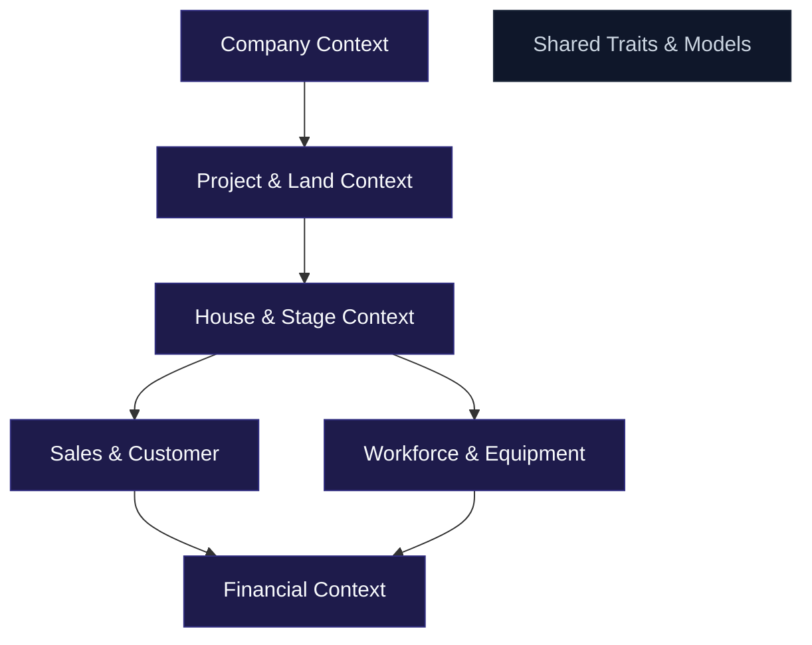

# Enterprise Construction ERP & Real Estate Management System — Software Architecture

This document describes the software architecture design for the multi-tenant Construction ERP, built using enterprise design principles, Clean Architecture, and Domain-Driven Design (DDD).

---

## 🏛️ System Architecture Layers

The backend system is designed with a strict separation of concerns into four concentric architectural layers:

```
          ┌──────────────────────────────────────────┐
          │               Presentation               │
          │         (HTTP Controllers, CLI)          │
          │     ┌──────────────────────────────┐     │
          │     │        Infrastructure        │     │
          │     │    (S3, Mail, Repositories)  │     │
          │     │     ┌──────────────────┐     │     │
          │     │     │   Application    │     │     │
          │     │     │ (Services, DTOs) │     │     │
          │     │     │     ┌──────┐     │     │     │
          │     │     │     │Domain│     │     │     │
          │     │     │     │Models│     │     │     │
          │     │     │     └──────┘     │     │     │
          │     │     └──────────────────┘     │     │
          │     └──────────────────────────────┘     │
          └──────────────────────────────────────────┘
```

### 1. Domain Layer (`App\Domain\*\Models`, `App\Domain\*\Enums`)
- **Location**: Core of the system.
- **Rules**: Contains all business entities, aggregates, values objects, and enums. It has zero external dependencies and does not know about databases, HTTP requests, or third-party packages.
- **Custom Traits**:
  - `HasUuid`: Enforces UUIDs for all primary keys to guarantee global uniqueness and simplify future microservices migration.
  - `BelongsToCompany`: Implements multi-tenancy row-level security using Laravel global scopes.
  - `HasAuditLog`: Automatically intercepts Eloquent lifecycle events to record change histories (who did what, when, and changes made).

### 2. Application Layer (`App\Domain\*\Services`, `App\Domain\*\DTOs`)
- **Location**: Intermediary coordinator.
- **Rules**: Contains application services and business use-case handlers. It mediates between the Presentation layer and the Domain/Infrastructure layers.

### 3. Infrastructure Layer (`App\Infrastructure`)
- **Location**: Integrates with external systems.
- **Rules**: Contains implementations of repositories, file storage adaptors (AWS S3/MinIO), SMS gateways, payment gateways, and reporting compilers (maatwebsite/excel, barryvdh/laravel-dompdf).

### 4. Presentation Layer (`App\Http`)
- **Location**: Interface endpoint handlers.
- **Rules**: Contains HTTP Controllers, Form Requests (validators), API Resources (transformers), and Middleware.

---

## 🔐 Multi-Tenant Boundary Isolation

The system uses a **Single Database with Row-Level Isolation** strategy for multi-tenancy:
- All tenant tables include a `company_id` foreign key.
- The `BelongsToCompany` trait automatically appends `where('company_id', auth()->user()->company_id)` to all SQL queries executed against scoped models.
- If a user attempts to query a resource belonging to another tenant via ID (e.g. `GET /api/v1/projects/other-company-uuid`), Laravel throws a `ModelNotFoundException` (404), ensuring complete data confidentiality.
- The `TenantMiddleware` acts as an entry guard, verifying the company status (`active`, `trial`, `suspended`, `inactive`) before forwarding the request.

---

## 🏗️ Core Bounded Contexts (DDD Domain Boundaries)



### 1. Company Context
- **Aggregates**: `Company`, `Branch`, `Department`
- **Scope**: Manages corporate structures, billing statuses, and multi-tenant branding.

### 2. Project & Land Context
- **Aggregates**: `Project`, `Milestone`, `ProjectRisk`, `Land`, `Block`, `Lot`
- **Scope**: Handles plot surveying, coordinates mapping (polygons), and construction milestone checkpoints.

### 3. House & Construction Context
- **Aggregates**: `HouseType`, `House`, `ConstructionStage`, `StageWorker`, `StageMaterial`, `Inspection`
- **Scope**: Tracks architectural details, structural villa building progress percentage, site material logs, and inspector sign-off checklists.

### 4. Workforce & Equipment Context
- **Aggregates**: `Employee`, `Contractor`, `Skill`, `Attendance`, `DailyReport`, `Equipment`
- **Scope**: Tracks internal employees and external subcontractors, daily check-ins, heavy crane/excavator project assignments, and machine fuel logs.

### 5. Sales & Customer Context
- **Aggregates**: `Lead`, `Customer`, `Reservation`, `Booking`, `SalesContract`, `PaymentPlan`
- **Scope**: Manages the buyer pipeline from lead intake, reserving a lot, booking payment schedules, and signing contracts.
